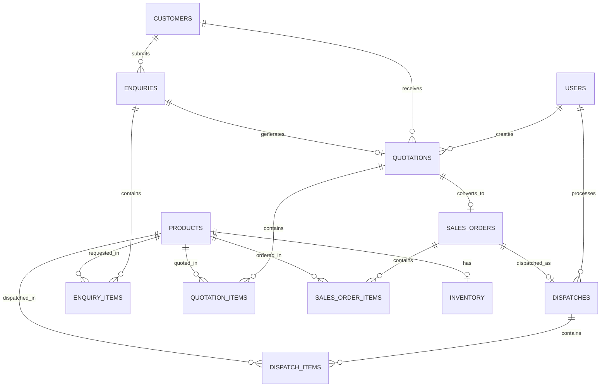

# Database Documentation

## Industrial Sales & Inventory Management System

**Database:** PostgreSQL  
**Database name:** `per_erp`  
**Total tables:** 12

## 1. Overview

The database supports the complete industrial sales workflow:

Customer → Enquiry → Quotation → Sales Order → Inventory Reservation → Dispatch

PostgreSQL stores user accounts, customer details, product information, sales transactions and inventory records.

## 2. Database Tables

| Table | Description |
|---|---|
| users | Stores user accounts, password hashes and roles |
| customers | Stores customer information |
| products | Stores industrial product details |
| inventory | Tracks physical and reserved stock |
| enquiries | Stores customer enquiries |
| enquiry_items | Stores products and quantities requested |
| quotations | Stores quotation details and totals |
| quotation_items | Stores quoted products, prices, discounts and GST |
| sales_orders | Stores orders generated from accepted quotations |
| sales_order_items | Stores products and quantities in each order |
| dispatches | Stores dispatch and transport details |
| dispatch_items | Stores products and quantities dispatched |

## 3. Important Table Fields

### Users
- id
- name
- Password hash
- Role

### Customers
- id
- company_name

### Products
- id
- Product name
- Product code
- Base price

### Inventory
- product_id
- physical_quantity
- reserved_quantity

### Enquiries
- id
- enquiry_number
- customer_id
- status

### Enquiry Items
- enquiry_id
- product_id
- quantity

### Quotations
- id
- quotation_number
- enquiry_id
- customer_id
- created_by
- valid_until
- grand_total
- status

### Quotation Items
- quotation_id
- product_id
- quantity
- unit_price
- discount_percent
- gst_percent
- line_amount

### Sales Orders
- id
- quotation_id
- order_number
- total_amount
- status

### Sales Order Items
- sales_order_id
- product_id
- quantity

### Dispatches
- id
- dispatch_number
- sales_order_id
- dispatch_date
- vehicle_number
- driver_name
- dispatched_by

### Dispatch Items
- dispatch_id
- product_id
- quantity

Refer to `database/schema.sql` for the complete column definitions, data types and constraints.

## 4. Entity Relationships

- One customer can have multiple enquiries.
- One enquiry can contain multiple products.
- An enquiry can be used to generate a quotation.
- A quotation contains multiple quotation items.
- An accepted quotation can be converted into a sales order.
- A sales order contains multiple products.
- A confirmed sales order can be dispatched.
- A dispatch contains multiple dispatch items.
- Inventory tracks stock for each product.
- Users create quotations and process dispatches.

## 5. ER Diagram



This diagram shows the main business relationships. The SQL schema contains the definitive foreign-key constraints.

## 6. Inventory Management

The system tracks three stock values:

- Physical stock: Actual stock in the warehouse.
- Reserved stock: Stock allocated to confirmed sales orders.
- Available stock: Stock available for new orders.

Formula:

```text
Available Stock = Physical Stock - Reserved Stock
```

Example:

| Operation | Physical | Reserved | Available |
|---|---:|---:|---:|
| Initial stock | 100 | 0 | 100 |
| Confirm order for 5 units | 100 | 5 | 95 |
| Dispatch 5 units | 95 | 0 | 95 |

The backend uses database transactions and conditional stock updates to prevent over-reservation.

## 7. Application Statuses

| Module | Implemented workflow |
|---|---|
| Enquiries | NEW → QUOTED → WON |
| Quotations | DRAFT → ACCEPTED |
| Sales Orders | PENDING → CONFIRMED → DISPATCHED |

These are the statuses used in the demonstrated workflow.

## 8. Database Transactions

Transactions are used for operations that update multiple related tables.

**Quotation creation:** Saves the quotation and quotation items, then updates the enquiry status.

**Sales order creation:** Creates the sales order and copies quotation items.

**Order confirmation:** Checks stock availability and reserves the required quantities.

**Dispatch:** Deducts physical and reserved stock, creates dispatch records and updates the sales order status.

If an operation fails, its transaction is rolled back to avoid partial updates.

## 9. Database Setup

1. Install PostgreSQL.
2. Create a database named `per_erp`.
3. Open the database in pgAdmin.
4. Execute `database/schema.sql`.
5. Run the project's seed script, if included.
6. Configure the backend database connection in `.env`.
7. Start the backend server.

Do not upload database passwords or the `.env` file to GitHub.